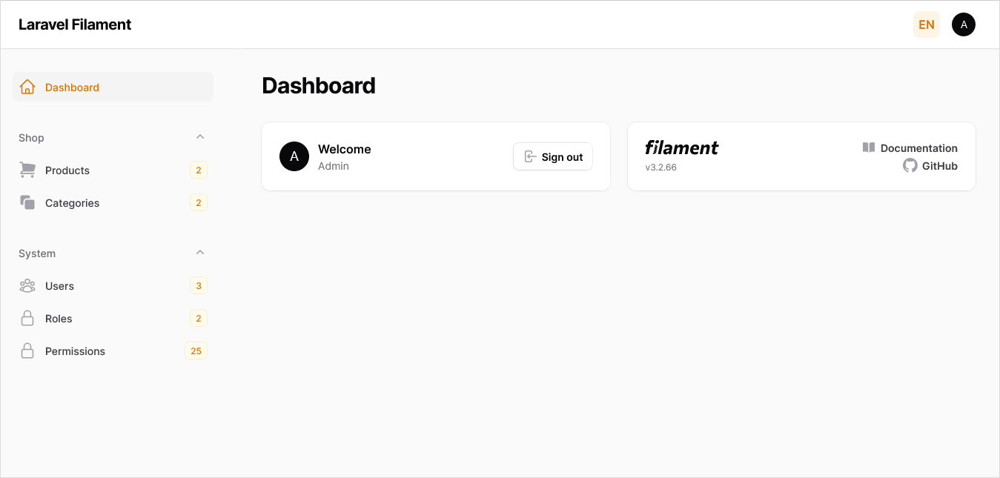
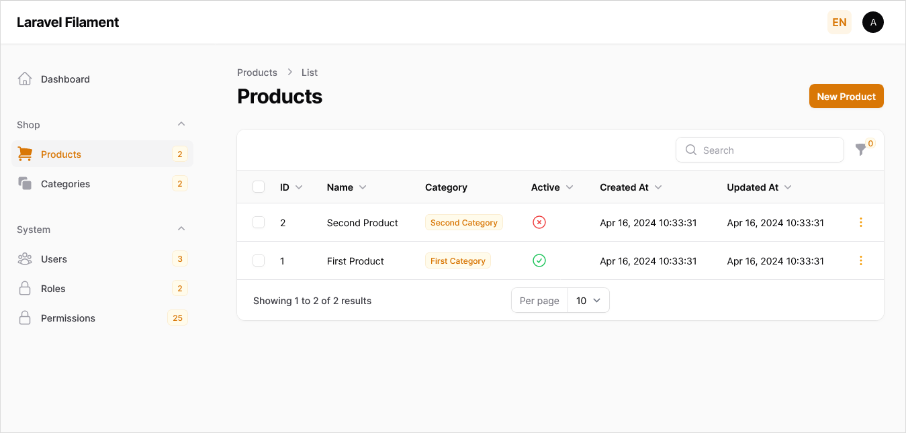
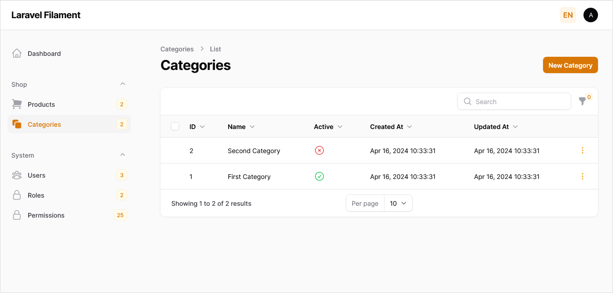
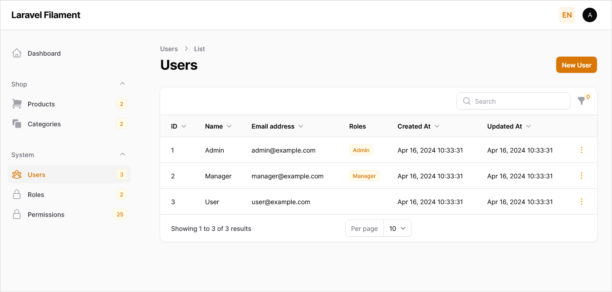
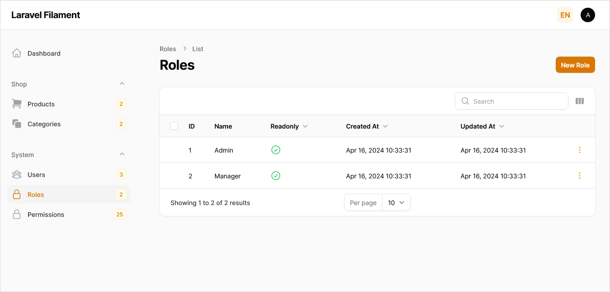
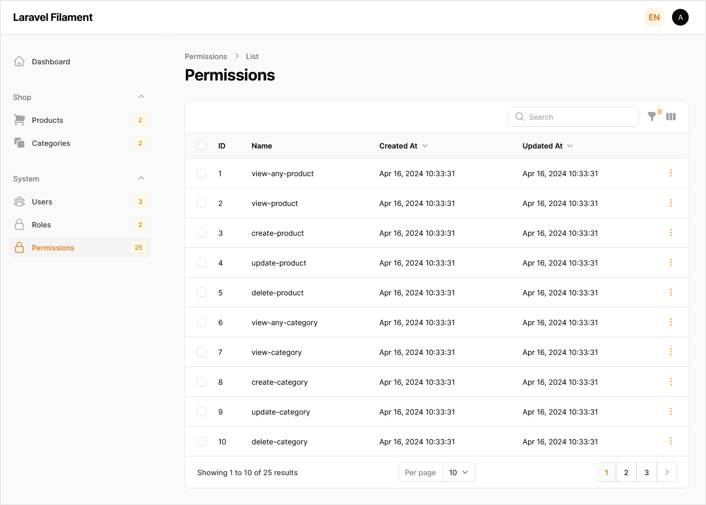
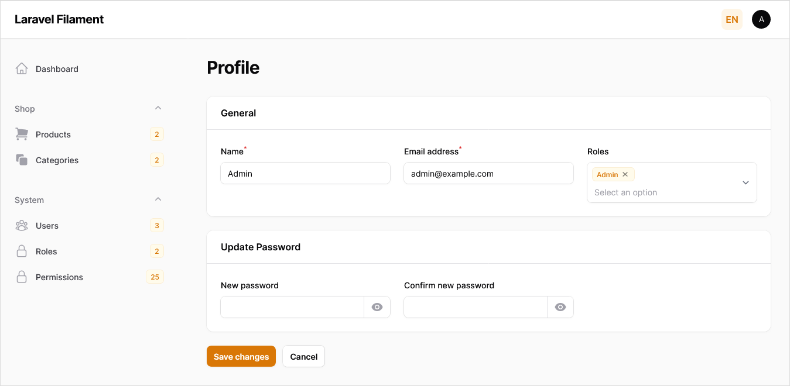

# Laravel Filament

The project is a multilingual admin panel basically based on the [Laravel 10](https://laravel.com/docs/10.x/installation) and [Filament 3](https://filamentphp.com/docs/3.x/panels/installation).

## Setup

Clone the repo and follow below steps.

1. Run `composer install`
2. Copy `.env.example` to `.env`
3. Run `php artisan key:generate` to generate application key
4. Set valid database credentials of env variables `DB_DATABASE`, `DB_USERNAME`, and `DB_PASSWORD`
5. Run `php artisan migrate --seed` to start all migrations and seed your database

## Demo Credentials

### Admin Login

- **Email:** admin@example.com
- **Password:** qwerty

### Manager Login

- **Email:** manager@example.com
- **Password:** qwerty

### User Login

- **Email:** user@example.com
- **Password:** qwerty

## Credits & References

The following software libraries and other references are utilized in the creation this project.

- [Laravel](https://github.com/laravel/laravel)
- [Filament](https://github.com/filamentphp/filament)
- [Althinect Filament Spatie Roles & Permissions](https://github.com/Althinect/filament-spatie-roles-permissions)
- [Bezhan Salleh Filament Language Switch](https://github.com/bezhanSalleh/filament-language-switch)
- [Personalizing Profile](https://medium.com/@laravelprotips/personalizing-the-filament-profile-page-expanding-the-design-and-integrating-multiple-forms-62db7ca68343)
- [Laravel Policies](https://arjunamrutiya.medium.com/mastering-laravel-policies-a-step-by-step-guide-a2a2caea13a1)

## License

The project is open-sourced software licensed under the [MIT license](https://opensource.org/licenses/MIT).

## ScreenShots

